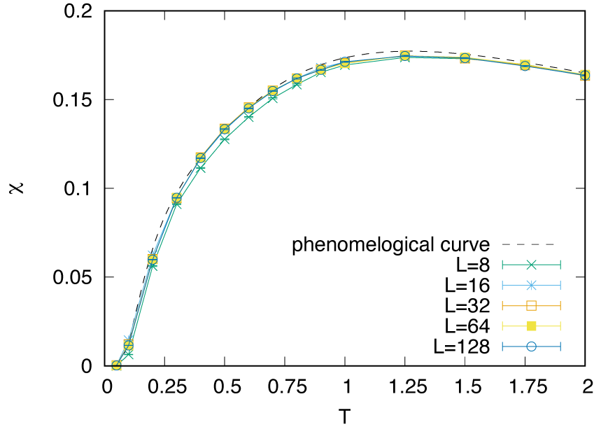

# Example for *moller* calculation with DSQSS

## What's this sample?

This is an example of `moller` with [DSQSS](https://github.com/issp-center-dev/DSQSS), which is an open-source software package for performing the path-integral Monte Calro method for quantum many-body problem.
In this example, we will calculate the temperature dependence of the magnetic susceptibilities $\chi$ of the $S=1/2$ ($M=1$ in the terms of DSQSS) and $S=1$ ($M=2$) antiferromagnetic Heisenberg chain under the periodic boundary condition with several length.
By using `moller`, calculations with different parameters ($M, L, T$) are performed in parallel.

This example is corresponding to [one of the official tutorials](https://issp-center-dev.github.io/dsqss/manual/develop/en/dla/tutorial/spinchain.html).

## Preparation

Make sure that `moller` (HTP-tools) package and `DSQSS` are installed.
In this tutorial, the calculation will be performed using the supercomputer system `ohtaka` at ISSP.

## How to run

1. Prepare dataset

    Run the script `make_inputs.sh` enclosed within this package.

    ```bash
    $ bash ./make_inputs.sh
    ```

    This make an `output` directory (if already exists, first removed then make again).
    Under `output`, working directories for each parameter like `L_8__M_1__T_1.0`  will be generated.
    A list of the directories is written to a file `list.dat`.

2. Generate job script using `moller`

    Generate a job script from the job description file using `moller`, and store the script as a file named `job.sh`.

    ```bash
    $ moller -o job.sh input.yaml
    ```

    Then, copy `job.sh` in the `output` directory, and change directory to `output`.

3. Run batch job

    Submit a batch job with the job list as an argument.

    ```bash
    $ sbatch job.sh list.dat
    ```

4. Check status

    The status of task execution will be summarized by `moller_status` program.

    ```bash
    $ moller_status input.yaml list.dat
    ```

5. Gather results

    After calculation finishes, gather result by

    ```bash
    $ python3 ../extract_result.py list.dat
    ```

    This script writes results into a text file `result.dat` which has 5 columns, $M$, $L$, $T$, mean of $\chi$, and stderr of $\chi$.

    To visualize the results, GNUPLOT files `plot_M1.plt` and `plot_M2.plt` are available.

    ```bash
    $ gnuplot --persist plot_M1.plt
    $ gnuplot --persist plot_M2.plt
    ```

    
    

    The main different between $S=1/2$ and $S=1$ AFH chains is whether the excitation gap vanishes ($S=1/2$) or remains ($S=1$).
    Reflecting this, the magnetic susceptibility in the very low temperature region remains finite ($S=1/2$) or vanishes ($S=1$).
    Note that for the $S=1/2$ case, the finite size effect opens the spin gap and therefore the magnetic susceptibility of small chains drops.
