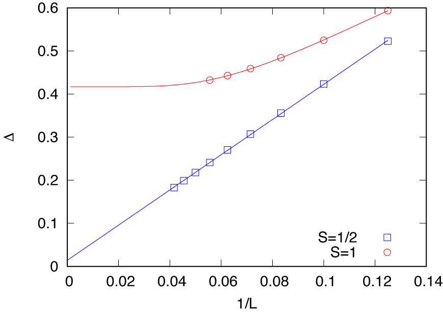

# Example for *moller* calculation with HPhi

## What's this sample?

This is an example of `moller` with [HPhi](https://github.com/issp-center-dev/HPhi), which is an open-source software package for performing the exact diagonalization method for quantum many-body problems.
In this example, we will calculate the system size dependence of the excitation gap $\Delta$ of the $S=1/2$ (`2S_1` directory) and $S=1$ (`2S_2`) antiferromagnetic Heisenberg chain under the periodic boundary condition.
By using `moller`, calculations with different system sizes are performed in parallel.
This is corresponding to [section 1.4](https://issp-center-dev.github.io/HPhi/manual/develop/tutorial/en/html/zero_temperature/spin_chain.html) of the official tutorial.

## Preparation

Make sure that `moller` (HTP-tools) package and `HPhi` are installed.
In this tutorial, the calculation will be performed using the supercomputer system `ohtaka` at ISSP.

## How to run

1. Prepare dataset

    Run the script `make_inputs.sh` enclosed within this package.

    ```bash
    $ bash ./make_inputs.sh
    ```

    Working directories `L_8`, `L_10`, ..., `L_24` (up to `L_18` for `2S_2`)) will be generated.
    A list of the directories is written to a file `list.dat`.
    Additionally, a shell script, `extract_gap.sh`, to gather energy gaps from working directories is generated.

2. Generate job script using `moller`

    Generate a job script from the job description file using `moller`, and store the script as a file named `job.sh`.

    ```bash
    $ moller -o job.sh input.yaml
    ```

    Then, copy `job.sh` in the `output` directory, and change directory to `output`.

3. Run batch job

    Submit a batch job with the job list as an argument.

    ```bash
    $ sbatch job.sh list.dat
    ```

4. Check status

    The status of task execution will be summarized by `moller_status` program.

    ```bash
    $ moller_status input.yaml list.dat
    ```

5. Gather results

    Once the calculation finishes, gather energy gaps from jobs as

    ```bash
    $ bash extract_gap.sh
    ```

    This script writes pairs of the length $L$ and the gap $\Delta$ into a text file, `gap.dat`.

    To visualize the results, a Gnuplot file `gap.plt` is available.
    In this file, the obtained gap data are fitted by the expected curves,

    $$\Delta(L; S=1/2) = \Delta_\infty + A/L$$

    and

    $$\Delta(L; S=1) = \Delta_\infty + B\exp(-CL).$$

    The resulting plot is obtained as follows:

    ```bash
    $ gnuplot --persist gap.plt
    ```

    

    Note that the logarithmic correction causes the spin gap for $S=1/2$ to remain finite.
    On the other hand, for $S=1$, the extrapolated value $\Delta_\infty = 0.417(1)$ is consistent with the previous results, e.g., $\Delta_\infty = 0.41048(6)$ by QMC (Todo and Kato, PRL **87**, 047203 (2001)).
